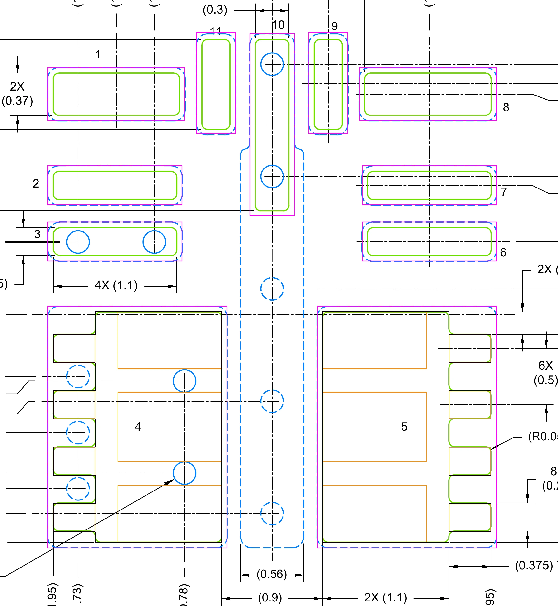

# RDN0011B land pattern, transcribed from SNVSCS7E

**Source.** TI SNVSCS7E rev E, `datasheets/TI-TPSM336xx-Q1-SNVSCS7E-revE.pdf`
(sha256 `59703a76…d572`), drawing **4231197/B 08/2025**:

| page | sheet |
|---|---|
| 46 | PACKAGE OUTLINE |
| **47** | **EXAMPLE BOARD LAYOUT / LAND PATTERN EXAMPLE** |
| 48 | EXAMPLE STENCIL DESIGN |

**Method.** Pages rendered with `pdftoppm -r 600 -png` and read as images in a
session carrying a `VISION-PROBE-PASS`. The drawing is vector, so the colours are
exact and separable: the pad outlines were extracted by colour
(`#6EDD00` green, `#007FFF` blue, `#FF0000` red) and measured in pixels, then
converted with a scale and origin fitted to the drawing's own ordinate callouts.
**Nothing below was reconstructed from the PDF text layer**, which lists the
callouts without their pairing and is exactly how a land pattern gets
transcribed wrong.

Calibration: 473.5 ± 1.0 px/mm at 600 dpi (drawing scale 20X). Origin = the
drawing's `0.000 SYMM ℄` (X) and `0.000 PKG ℄` (Y). Residual anisotropy between
the fitted X and Y scales was 0.25 %, i.e. ±0.005 mm over a pad — below the
rounding of every callout, but it is why the values below are taken from the
callouts wherever a callout exists, and from the measurement only where one
does not.

## Which colour is which — this inverts the usual convention

The SOLDER MASK DETAILS panel on p.47 carries two illustrations. Reading their
leaders:

- **green = SOLDER MASK OPENING**
- **blue dashed = METAL**

The main view draws blue **outside** green, which is the panel's right-hand case:
**SOLDER MASK DEFINED, and TI marks it `(PREFERRED)`**, `0.05 MIN ALL AROUND`.
This is the opposite of the TMP117 (SNOSD82D marks NSMD preferred) and the
opposite of Aisler's default +50 µm mask expansion. Measured directly on pin 1:
green 1.1213 mm wide, blue 1.2215 mm wide → **0.0501 mm per side**. Honour it
with a negative mask margin; do not let the fab's default invert it.

## Copper pads (F.Cu), top view, millimetres

Origin = package centre as defined by the drawing. +X right, +Y up, matching
Figure 5-1 (p.5) **TOP VIEW**, which is the orientation the land pattern is
drawn in (pin 1 upper-left in both).

| pin | name | centre X | centre Y | width | height |
|---:|---|---:|---:|---:|---:|
| 1 | PGOOD | −1.3875 | +1.960 | 1.225 | 0.470 |
| 2 | EN | −1.400 | +1.150 | 1.200 | 0.350 |
| 3 | VIN | −1.400 | +0.650 | 1.200 | 0.350 |
| 4 | VOUT | −1.200 | −0.995 | 1.600 | 2.150 |
| 5 | SW | +1.200 | −0.995 | 1.600 | 2.150 |
| 6 | SW | +1.400 | +0.650 | 1.200 | 0.350 |
| 7 | BOOT | +1.400 | +1.150 | 1.200 | 0.350 |
| 8 | VCC | +1.3875 | +1.960 | 1.225 | 0.470 |
| 9 | FB | +0.500 | +2.060 | 0.350 | 0.900 |
| 10 | GND | 0.000 | +1.690 | 0.400 | 1.620 |
| 11 | MODE/SYNC | −0.500 | +2.060 | 0.350 | 0.900 |

Corner radius `(R0.05) TYP` on every pad. Pin numbering and names are from
Figure 5-1 and the Pin Functions table, p.5.

### The callout that is easy to get wrong

`(1.3875)` and `(1.4)` are **two different ordinates**, not a rounding of one.
Pins 1, 2 and 3 share an **outer edge at X = −1.95** (`4X (1.95)`), but pin 1 is
1.125 wide where pins 2 and 3 are 1.100 wide (`2X (1.125)` vs `4X (1.1)`, both
mask-opening widths). So their centres differ:

```
pin 1   -1.95 + 1.125/2 = -1.3875      pins 2,3   -1.95 + 1.100/2 = -1.400
```

Mirrored for pins 8 and 6, 7. A transcription that collapses both to 1.4 puts
pins 1 and 8 0.0125 mm off; one that collapses both to 1.3875 puts four pads off.

## Solder mask openings (F.Mask)

For **pins 1, 2, 3, 6, 7, 8, 9, 10, 11**: the copper rectangle **inset 0.05 all
round**, i.e. `solder_mask_margin = -0.05`.

| pin | mask opening |
|---:|---|
| 1, 8 | 1.125 × 0.370 (`2X (1.125)`, `2X (0.37)`) |
| 2, 3, 6, 7 | 1.100 × 0.250 (`4X (1.1)`, `6X (0.25)`) |
| 9, 11 | 0.250 × 0.800 (`6X (0.25)`, `2X (0.8)`) |
| 10 | 0.300 × 1.520 (`(0.3)`, `(1.52)`) |

`6X (0.25)` covers six pads: 2, 3, 6, 7 (height) and 9, 11 (width).

**Pins 4 and 5 are different, and this is the whole point of the package.** The
copper is a plain 1.600 × 2.150 rectangle, but the mask opening is *not* that
rectangle inset — it is a lead-finger shape, because RDN is flip-chip-on-lead and
the package terminal only touches the board at the fingers. Measured profile of
pin 5 (mirror for pin 4):

```
body        X  +0.450 .. +1.575        Y  +0.030 .. -2.020     (1.125 x 2.050)
4 fingers   X  +1.575 .. +1.950        0.250 tall, 0.375 deep  ((0.375) TYP)
            finger centres Y = -0.30, -0.80, -1.30, -1.80      (2X (0.3), 6X (0.5))
            finger span 0.175 .. 1.925                          (2X (1.75))
            outer edge +1.950                                   (4X (1.95))
```

Measured finger centres: −0.2985, −0.7965, −1.2945, −1.7945 (pitch 0.498, 0.498,
0.500). `8X (0.25)` = four fingers on each of the two pads.

A KiCad pad carries one mask aperture concentric with its copper, so **pins 4 and
5 must not generate their own mask**: give the pad `F.Cu` only and draw the
finger outline as an `F.Mask` polygon in the footprint. Flattening it to a plain
1.5 × 2.05 opening would expose a 0.375 mm strip of copper along the outer edge
of each pad with no terminal above it to wet — a solder-beading invitation on the
two pads that carry all the current.

## Solder paste (F.Paste), from p.48

Stencil basis: **0.1 mm thick**, `PIN 4 & 5: 72% SOLDER COVERAGE BY AREA`.

- **Pins 1, 2, 3, 6, 7, 8, 9, 10, 11 — aperture = mask opening, 1:1.** Verified
  by measurement, not assumed: the red apertures measure within 1 px of the green
  openings (e.g. pin 1: 537 × 182 px red vs 536 × 182 px green; pin 10:
  147 × 726 vs 146 × 725).
- **Pins 4 and 5 — seven apertures each**, and KiCad cannot express that as one
  pad either, so these are `F.Paste` polygons alongside the mask polygons:

| aperture | count/pad | size | centre X (pin 5) | centre Y |
|---|---:|---|---:|---:|
| body upper | 1 | 0.930 × 0.510 | +0.910 | −0.230 |
| body middle | 1 | 0.930 × 0.620 | +0.910 | −1.000 |
| body lower | 1 | 0.930 × 0.510 | +0.910 | −1.770 |
| finger | 4 | 0.375 × 0.250 | +1.760 | −0.30, −0.80, −1.30, −1.80 |

Callouts: `6X (0.93)`, `4X (0.51)`, `2X (0.62)`, `3X (0.91)`, `8X (0.375)`,
`8X (0.25)`, `(1.76)`, `2X (0.23)`, `2X (1)`, `2X (1.77)`, `6X (0.5)`.

**Coverage check, and what it is a fraction of.** Per pad:

```
body      0.930 x (0.510 + 0.620 + 0.510)  = 1.5252 mm^2
fingers   4 x (0.375 x 0.250)              = 0.3750 mm^2
                                     total = 1.9002 mm^2

mask opening  1.125 x 2.050 + 4 x (0.375 x 0.250) = 2.68125 mm^2
coverage = 1.9002 / 2.68125 = 70.9 %   ->  TI's "72%" (they include the R0.05 corners)

against COPPER (1.600 x 2.150 = 3.44 mm^2) it would read 55.2 %
```

So TI's 72 % is referenced to the **mask opening**, not the copper. Any guard
that re-derives this number must divide by the same thing or it will "fail" a
correct stencil. The body apertures sit flush with the mask body's inner edge and
are inset 0.200 from its outer edge, which is what keeps body paste and finger
paste from merging.

## Recorded but deliberately not in the footprint

The p.47 view also shows TI's suggested **board** copper and vias, which Note 5
makes explicitly optional ("Vias are optional depending on application"). These
belong in `gen_pcb.py`, not the land:

- A **0.56 mm wide copper strip** (X = ±0.28) running from Y = +1.48 — where it
  meets the pin-10 land — down the centre to Y = −2.07, between the pin 4 and
  pin 5 lands. The 0.9 mm figure on the drawing is the *mask* gap between pins 4
  and 5, not this strip.
- **Ø0.2 vias** (`(0.2) TYP VIA`): three in the pin-10 land / centre strip at
  Y = 2.23, 1.23, 0.23; three in the pin 4 land and three in pin 5 at X = ∓1.73,
  Y = −0.55, −1.05, −1.55, with the mask opening notched around them (tented);
  and two open vias per big pad at X = ∓0.78, Y = −0.55 and −1.41.
- The pin-3 land carries two vias at X = −1.729 and −1.05, Y = +0.65.

## Verification: the generated footprint, overlaid on p.47



`lib/buck-tpsm33610.pretty/TPSM336xx_QFN-FCMOD-11_RDN0011B_TI.kicad_mod` was
re-parsed from disk (not from `gen_fp.py`'s intent), every pad converted back to
datasheet coordinates, and drawn onto the 600 dpi render of p.47 at the fitted
scale: **magenta = emitted copper, black = emitted F.Mask polygon, orange =
emitted F.Paste apertures.** Read visually in a `VISION-PROBE-PASS` session.

All eleven magenta rectangles sit on TI's blue metal outlines; the black polygon
traces the green lead-finger opening on both large pads, including all four
finger steps; the paste apertures sit inside the mask body. The wider pins 1 and
8 (1.225) versus pins 2, 3, 6, 7 (1.200) are visible and correct.

**Land pattern verified against SNVSCS7E p.47, drawing 4231197/B 08/2025.**

## Two rounding errors in TI's own stencil callouts

Guard 4 in `gen_fp.py` (paste must lie inside the mask opening) fired on the
literal p.48 numbers, twice. Both are the drawing rounding to two decimals:

| callout | taken literally | un-rounded | why |
|---|---|---|---|
| `3X (0.91)`, `6X (0.93)` | body aperture spans 0.445–1.375, i.e. 0.005 **outside** the mask body's 0.450 inner edge | centre **0.9125**, width **0.925** → 0.450–1.375 | flush inner edge, round 0.200 outer margin |
| `(1.76)` | finger aperture spans 1.5725–1.9475, 0.0025 outside the finger's 1.575 edge | centre **1.7625** | the aperture *is* the finger, 1.575–1.950 |

The same reasoning fixes `2X (0.23)`, `2X (1)`, `2X (1.77)` → centres −0.225,
−0.995, −1.765, which makes the top and bottom apertures flush with the mask
body and the two gaps between apertures equal at 0.205. The measured pixel
values (0.927 wide at X 0.913, centres −0.229/−0.996/−1.763) fit the un-rounded
numbers better than the printed ones, so this is un-rounding, not invention.

Recomputed coverage with the un-rounded values: **70.6 %** of the mask opening
(TI print 72 %; the remainder is their rounded corners, which this footprint
also has at R0.05).

## Manufacturability: this land is finer than the fab's rules

| gap | value |
|---|---|
| pins 1–11, 8–9 | **0.100 mm** |
| pins 9–10, 10–11 | 0.125 mm |
| pins 2–3, 6–7 | 0.150 mm |
| mask dam, everywhere | ≥0.200 mm (solder-mask-defined *widens* the dam) |

0.100 mm is under every published Aisler 2-layer rule (35 µm ENIG 125 µm, 35 µm
HASL 150 µm, 70 µm ENIG 175 µm, 70 µm HASL 225 µm) and under JLCPCB 2L (127 µm)
and PCBWay 2L standard (150 µm).

**Decision, Fab, 2026-09-13: build it untrimmed at 35 µm ENIG and accept the
rule break** — *"the aisler rules are conservative, breaking the rules has always
worked so far, no bad boards."* `gen_fp.py` prints the violation and its factor
(1.25×) on every run so it stays visible; `MIN_GAP` there is calibrated to the
package's 0.100 mm, not to the fab.

This is also why the copper stays **35 µm**. At 70 µm the same gap is 1.75×
under the rule *and* about 0.7:1 in etch aspect ratio — a physical limit rather
than a conservative one. The 70 µm option was worth roughly 10 °C of ambient
headroom; it is the one place on this board where the rule should not be broken.
The back-out, if a board ever returns with a short under the module, is the
documented `TRIM` table in `gen_fp.py`: 0.150 mm minimum gap at a cost of 15 %
of the wetted joint width on FB and MODE/SYNC.

## Unresolved

None. Every dimension callout on p.47 and p.48 is paired to a feature above, and
every pad edge is fixed by at least one named callout rather than by measurement
alone. The measurement and the callouts agree to ≤0.005 mm everywhere.
